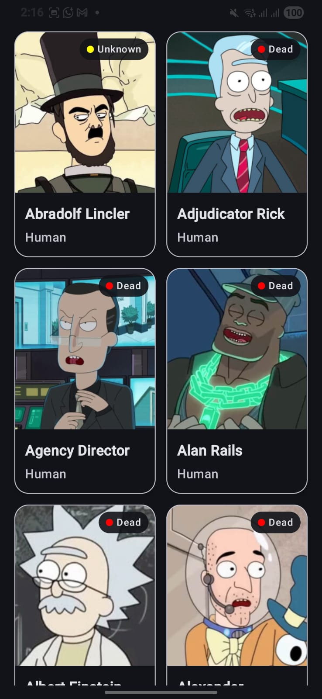
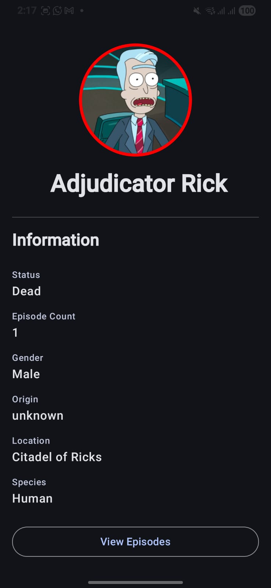
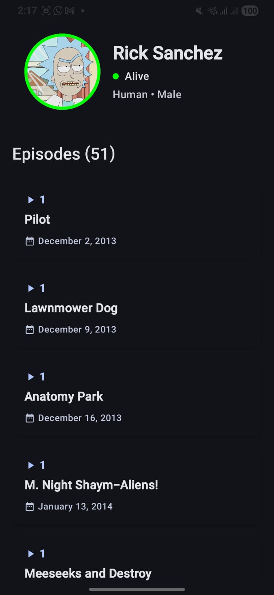

# RickAndMortyApp

## Initial Design

  
  
  

## About the Project

RickAndMortyApp is a native Android application built to browse characters, episodes, and details from the famous Rick and Morty universe. The project aims to provide a fast and beautiful user experience while demonstrating modern Android development practices, including a robust MVI (Model-View-Intent) architecture for clean separation of concerns.

## Key Features

- **MVI Architecture**: Built using a highly decoupled MVI business-logic and state-management layer for robust state tracking.
- **Firebase Authentication**: Secure user login and authentication powered by Firebase.
- **Character Explorer**: Browse the complete list of characters with seamless pagination.
- **Search & Filtering**: Search for specific characters and filter by their status (Alive, Dead, Unknown).
- **Session & Settings Persistence**: Locally stored settings and session states for a smooth returning user experience.
- **Dependency Injection**: Uses Hilt for managing dependencies cleanly and efficiently.
- **Modern UI**: Built with Jetpack Compose following Material Design guidelines for an immersive, responsive interface.
